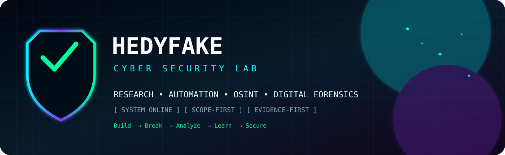
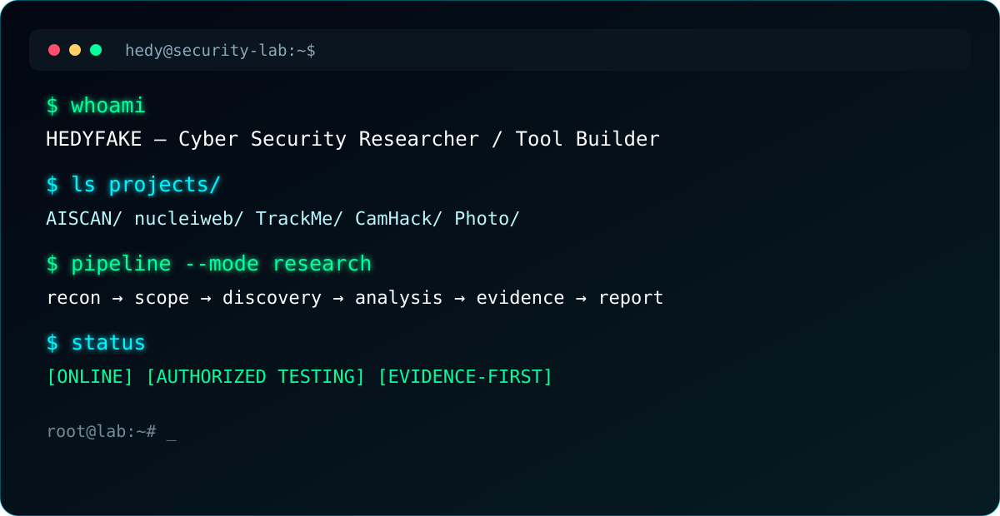
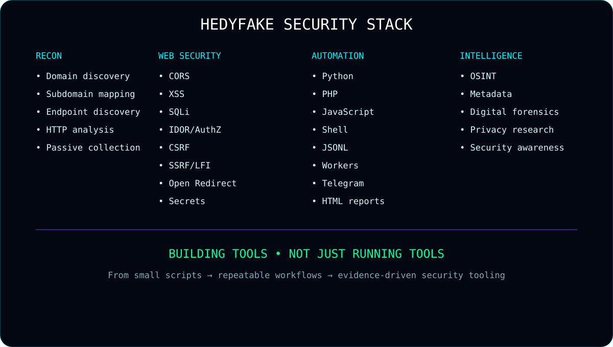
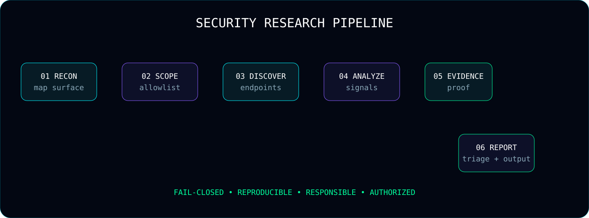

<div align="center">



# `HEDYFAKE` // CYBER SECURITY LAB

### `SECURITY RESEARCH` · `TOOL DEVELOPMENT` · `AUTOMATION` · `OSINT` · `DIGITAL FORENSICS`


[](https://github.com/HedyFake)
[](https://github.com/HedyFake)
[](https://www.python.org/)
[](https://www.php.net/)
[](https://github.com/HedyFake)

</div>

---



## 🧬 `WHOAMI`

Saya membangun portofolio ini sebagai **laboratorium pembelajaran keamanan siber**: bukan sekadar mengumpulkan tool, tetapi mengembangkan workflow dari pengumpulan informasi, penentuan scope, discovery, analisis, validasi evidence, triage, sampai reporting.

Perjalanan project saya bergerak dari script dan eksperimen kecil menuju workflow yang lebih terstruktur:

```text
SCRIPT
  │
  ├──► RECON
  │
  ├──► SECURITY TESTING
  │
  ├──► AUTOMATION
  │
  ├──► EVIDENCE
  │
  ├──► REPORTING
  │
  └──► AI-ASSISTED ANALYSIS
             │
             ▼
       SECURITY WORKFLOW
```

> **Mindset:** tool yang bagus bukan hanya bisa menjalankan command; tool yang bagus membantu menghasilkan proses yang dapat diulang, evidence yang dapat diperiksa, dan laporan yang dapat dipahami.

---

## 🛰️ `PORTFOLIO OVERVIEW`


| Project | Domain | Highlight |
|---|---|---|
| [AISCAN](https://github.com/HedyFake/AISCAN) | Web Security / AI | Mass + Single scanning, AI analysis, secrets, triage, reports |
| [nucleiweb](https://github.com/HedyFake/nucleiweb) | Automation | Nuclei jobs, workers, JSONL, Telegram, reporting |
| [TrackMe](https://github.com/HedyFake/TrackMe) | Privacy Research | Browser geolocation & device-information awareness |
| [CamHack](https://github.com/HedyFake/CamHack) | Security Awareness | Webcam permission/privacy research |
| [Photo](https://github.com/HedyFake/Photo) | OSINT / Forensics | Image metadata and digital-forensics analysis |

---

# 🧠 AISCAN — AI-ASSISTED SECURITY SCANNING

**Repository:** https://github.com/HedyFake/AISCAN

AISCAN adalah salah satu project utama dalam portofolio ini. Fokusnya adalah membangun workflow security scanning yang memisahkan mode **Mass Scan** dan **Single Scan**, menggabungkan reconnaissance, security modules, evidence, triage, dan AI-assisted reporting.

### ⚡ Dua mode utama

```text
┌──────────────────────────────┐
│          AISCAN              │
├──────────────────────────────┤
│                              │
│  MASS                         │
│  ├─ targets.txt               │
│  ├─ parallel processing       │
│  ├─ combined results          │
│  └─ multi-target report       │
│                              │
│  SINGLE                       │
│  ├─ one URL/domain             │
│  ├─ focused testing            │
│  ├─ no mass enumeration        │
│  └─ focused report             │
│                              │
└──────────────────────────────┘
```

### 🔎 Security areas yang menjadi bagian dari workflow

- CORS
- XSS
- SQL Injection
- IDOR / authorization
- LFI
- SSRF
- CSRF
- Open Redirect
- Authentication
- Session security
- Security headers
- Hidden parameters
- Content discovery
- Secrets detection
- Sensitive information exposure
- Cryptography / transport security
- Business-logic related checks
- React Server Actions / Keycloak-related checks pada workflow yang relevan

### 🤖 AI-assisted analysis

AI digunakan sebagai lapisan **analisis/triage**, bukan sebagai pengganti evidence teknis.

```text
RAW FINDINGS
     ↓
NORMALIZATION
     ↓
EVIDENCE
     ↓
AI ANALYSIS
     ↓
TRIAGE / CONTEXT
     ↓
HTML / MARKDOWN REPORT
```

Tujuannya adalah membantu mengubah data mentah menjadi penjelasan yang lebih mudah dibaca:

- apa yang ditemukan;
- endpoint atau komponen terkait;
- evidence yang tersedia;
- konteks risiko;
- kemungkinan false positive;
- rekomendasi perbaikan;
- prioritas investigasi.

### 🔐 Secrets detection

AISCAN juga memiliki konsep secret-scanning engine untuk mencari indikasi credential/API key/token pada artefak yang dianalisis.

Prinsip penting:

```text
DETECT
  ↓
CLASSIFY
  ↓
REDACT WHEN NECESSARY
  ↓
EVIDENCE
  ↓
REPORT
```

Jangan menampilkan secret asli di README, issue publik, screenshot, atau laporan yang dibagikan tanpa kebutuhan dan izin.

### 🧱 Scope-first

Salah satu prinsip yang saya gunakan:

```text
NO SCOPE
   ↓
NO ACTIVE TEST
```

Allowlist dan batasan target digunakan agar workflow lebih mudah dikontrol.

Contoh konsep:

```yaml
authorized_domains:
  - example.com

allow_subdomains: true

excluded_paths:
  - /logout
  - /delete
  - /destroy
  - /remove
```

Konfigurasi aktual dapat berbeda mengikuti kebutuhan lab/project.

### 📑 Evidence-first reporting

Output yang baik bukan hanya:

```text
VULNERABLE
```

tetapi:

```text
Finding
├── Category
├── Target
├── Endpoint
├── Evidence
├── Confidence
├── Context
├── Reproduction notes
├── Remediation
└── References
```

---

# ☢️ NUCLEIWEB — AUTOMATION PIPELINE

**Repository:** https://github.com/HedyFake/nucleiweb

nucleiweb berfokus pada membuat workflow Nuclei lebih terstruktur melalui web interface, job management, background worker, JSONL processing, reporting, dan Telegram notification.

### 🔄 Architecture

```text
             TARGET
                │
                ▼
        ┌───────────────┐
        │  WEB INTERFACE│
        └───────┬───────┘
                │
                ▼
          JOB WORKSPACE
                │
                ▼
          BACKGROUND WORKER
                │
                ▼
             NUCLEI
                │
                ▼
             JSONL
                │
        ┌───────┴────────┐
        ▼                ▼
    PARSER            GROUPING
        │                │
        └───────┬────────┘
                ▼
             REPORT
                │
        ┌───────┴────────┐
        ▼                ▼
      WEB UI           TELEGRAM
```

### 🧩 Komponen yang dipelajari

- Job lifecycle
- Target normalization
- Workspace per job
- Background processing
- Nuclei execution
- stdout/stderr handling
- JSONL parsing
- Finding grouping
- Per-target reports
- Group reports
- Telegram notifications
- Error handling

Project ini menjadi contoh bagaimana security scanner dapat diubah dari command-line workflow menjadi pipeline automation yang lebih mudah digunakan.

---

# 🌍 TRACKME — PRIVACY & GEOLOCATION RESEARCH

**Repository:** https://github.com/HedyFake/TrackMe

TrackMe digunakan sebagai **authorized privacy/security-awareness research** untuk memahami informasi yang dapat tersedia melalui browser APIs dan permission model.

### 🔬 Area penelitian

```text
Browser
 │
 ├── Permission
 │
 ├── Geolocation
 │     ├── latitude
 │     ├── longitude
 │     ├── accuracy
 │     ├── altitude
 │     ├── speed
 │     └── heading
 │
 ├── Device information
 │     ├── platform
 │     ├── CPU cores
 │     ├── memory
 │     ├── screen
 │     ├── battery
 │     └── user-agent
 │
 └── Privacy awareness
```

Nilai pembelajarannya bukan sekadar "mendapatkan lokasi", tetapi memahami:

- bagaimana permission bekerja;
- data apa yang browser expose;
- mengapa consent penting;
- bagaimana data sensitif dapat menjadi privacy risk;
- bagaimana sistem seharusnya meminimalkan collection.

**Penggunaan harus terbatas pada perangkat, akun, dan lingkungan yang memiliki izin.**

---

# 📷 CAMHACK — WEBCAM SECURITY AWARENESS

**Repository:** https://github.com/HedyFake/CamHack

CamHack diposisikan sebagai **security-awareness PoC**, bukan alat untuk mengambil kamera orang lain.

### 🎥 Fokus penelitian

- Browser camera permission
- User consent
- Privacy
- Security awareness
- Web server behavior
- Public tunneling concepts
- Data lifecycle

```text
USER
  │
  ▼
BROWSER PERMISSION
  │
  ├── DENY ──────► NO CAMERA DATA
  │
  └── ALLOW
       │
       ▼
  AUTHORIZED LAB
       │
       ▼
  SECURITY ANALYSIS
```

Project seperti ini penting untuk memahami bahwa keamanan tidak hanya tentang vulnerability teknis. **User consent, social engineering awareness, permission prompts, dan data handling juga merupakan bagian dari security.**

---

# 🖼️ PHOTO — OSINT & DIGITAL FORENSICS

**Repository:** https://github.com/HedyFake/Photo

Project Photo berfokus pada analisis gambar untuk kebutuhan OSINT, metadata analysis, dan digital-forensics learning.

### 🔍 Workflow

```text
IMAGE
  ↓
FILE INSPECTION
  ↓
METADATA / EXIF
  ↓
TECHNICAL ANALYSIS
  ↓
OSINT INDICATORS
  ↓
PRIVACY REVIEW
  ↓
REPORT
```

### Data/indikator yang dapat dianalisis

- EXIF
- Camera information
- Image dimensions
- File properties
- Metadata
- Potential location indicators
- Software/editor information
- Privacy-sensitive information
- Forensic observations

Tujuan utamanya adalah memahami bahwa sebuah gambar dapat membawa lebih banyak informasi daripada yang terlihat secara visual.

---

# 🧩 `SECURITY STACK`



### 🐍 Programming


### 🛡️ Security / Research


### ⚙️ Automation


---

# 🧪 SECURITY METHODOLOGY



Saya membangun workflow berdasarkan beberapa prinsip:

### 01 — Scope First

Sebelum melakukan active testing:

```text
Target
 ↓
Authorization
 ↓
Scope
 ↓
Rules
 ↓
Testing
```

### 02 — Evidence First

Temuan tanpa evidence harus diperlakukan sebagai sinyal yang perlu divalidasi.

### 03 — Reproducibility

Hasil harus dapat ditelusuri kembali:

```text
TARGET
→ REQUEST
→ RESPONSE
→ OBSERVATION
→ EVIDENCE
→ FINDING
```

### 04 — Fail Closed

Jika scope tidak jelas, workflow sebaiknya berhenti daripada memperluas target secara tidak sengaja.

### 05 — Human Review

AI dan automation membantu analisis, tetapi keputusan akhir atas validitas finding tetap memerlukan pemeriksaan manusia.

---

# 📊 `MY SECURITY TOOLING PHILOSOPHY`

```text
┌─────────────────────────────────────────────┐
│           DON'T JUST RUN TOOLS              │
├─────────────────────────────────────────────┤
│                                             │
│ Understand the tool                         │
│          ↓                                  │
│ Understand the protocol                     │
│          ↓                                  │
│ Understand the evidence                     │
│          ↓                                  │
│ Automate repetitive work                    │
│          ↓                                  │
│ Keep humans in the loop                     │
│          ↓                                  │
│ Produce readable reports                    │
│                                             │
└─────────────────────────────────────────────┘
```

Hal yang saya pelajari dari project-project ini:

- reconnaissance bukan sekadar menjalankan subdomain tool;
- scanner bukan sekadar daftar vulnerability;
- AI bukan sekadar chatbot;
- reporting bukan sekadar dump JSON;
- OSINT bukan sekadar mencari informasi;
- privacy research bukan sekadar mengambil data;
- automation harus tetap memiliki batasan dan scope.

---

# 🧠 AI + SECURITY

Dalam workflow AI-assisted, saya membagi pekerjaan menjadi beberapa layer:

```text
┌──────────────────────────────┐
│ COLLECTION                   │
│ target / response / evidence │
└──────────────┬───────────────┘
               ↓
┌──────────────────────────────┐
│ NORMALIZATION                │
│ clean / deduplicate / group  │
└──────────────┬───────────────┘
               ↓
┌──────────────────────────────┐
│ AI ANALYSIS                  │
│ context / explanation / triage│
└──────────────┬───────────────┘
               ↓
┌──────────────────────────────┐
│ HUMAN VALIDATION              │
│ verify / reject / investigate│
└──────────────┬───────────────┘
               ↓
┌──────────────────────────────┐
│ REPORT                       │
│ finding / evidence / fix     │
└──────────────────────────────┘
```

**AI digunakan sebagai alat bantu analisis. Evidence teknis tetap menjadi dasar validasi.**

---

# 🧰 RESEARCH TOOLBOX

Beberapa konsep/tool yang pernah menjadi bagian dari workflow project:

- Nuclei
- Subfinder
- CORS scanning
- XSS testing
- Open Redirect testing
- CSRF testing
- HTTP security analysis
- Secrets scanning
- Content discovery
- OSINT
- EXIF analysis
- Browser APIs
- Telegram Bot API
- ngrok / tunneling untuk lab
- JSONL pipelines
- HTML reporting
- AI-assisted analysis

---

# 🗂️ PROJECT EVOLUTION

```text
             ┌─────────────────┐
             │ Small Scripts   │
             └────────┬────────┘
                      ↓
             ┌─────────────────┐
             │ Security Tools  │
             └────────┬────────┘
                      ↓
             ┌─────────────────┐
             │ Automation      │
             └────────┬────────┘
                      ↓
             ┌─────────────────┐
             │ Multi-tool Flow │
             └────────┬────────┘
                      ↓
             ┌─────────────────┐
             │ Evidence        │
             └────────┬────────┘
                      ↓
             ┌─────────────────┐
             │ Reporting       │
             └────────┬────────┘
                      ↓
             ┌─────────────────┐
             │ AI Assistance   │
             └────────┬────────┘
                      ↓
             ┌─────────────────┐
             │ Security Lab    │
             └─────────────────┘
```

---

# 🏆 WHAT I BUILD

| Capability | Example |
|---|---|
| 🔎 Recon | Domain/subdomain and endpoint discovery |
| 🛡️ Web Security | CORS, XSS, SQLi, AuthZ, SSRF, LFI, CSRF |
| 🤖 AI | Finding explanation, triage, report assistance |
| ⚙️ Automation | Workers, pipelines, JSONL |
| 📊 Reporting | HTML/Markdown reports |
| 📱 Integration | Telegram notifications |
| 🕵️ OSINT | Image and metadata analysis |
| 🔐 Privacy | Browser permission/data exposure research |
| 🎥 Awareness | Webcam permission research |
| 🧪 Validation | Evidence-driven findings |

---

# 🧑‍💻 `LAB RULES`

```text
[01] OWN IT OR HAVE PERMISSION
[02] DEFINE SCOPE
[03] COLLECT MINIMUM NECESSARY DATA
[04] DO NOT EXPOSE SECRETS
[05] VALIDATE BEFORE REPORTING
[06] KEEP EVIDENCE
[07] REPORT RESPONSIBLY
[08] CLEAN UP AFTER TESTING
```

Project yang berhubungan dengan geolocation, webcam, tunneling, credential-like data, atau active scanning harus digunakan hanya pada environment yang memang diizinkan.

---

# 🎮 `HACKER TERMINAL MODE`

```text
┌─────────────────────────────────────────────────────────────┐
│ HEDY SECURITY TERMINAL                                     │
├─────────────────────────────────────────────────────────────┤
│                                                             │
│ > boot security-lab                                         │
│ [ OK ] recon engine                                         │
│ [ OK ] scope engine                                         │
│ [ OK ] evidence engine                                     │
│ [ OK ] report engine                                       │
│ [ OK ] AI analysis layer                                   │
│                                                             │
│ > status                                                    │
│                                                             │
│ SYSTEM: ONLINE                                               │
│ MODE:   AUTHORIZED RESEARCH                                  │
│ SCOPE:  REQUIRED                                             │
│ DATA:   MINIMIZED                                            │
│ EVIDENCE: ENABLED                                            │
│                                                             │
│ > echo "Build. Break. Analyze. Learn. Secure."              │
│ Build. Break. Analyze. Learn. Secure.                       │
│                                                             │
└─────────────────────────────────────────────────────────────┘
```

---

# 🌐 REPOSITORY MAP

### 🔵 AISCAN
AI-assisted security scanning, reconnaissance, security modules, evidence, secrets, triage, dan reporting.

→ https://github.com/HedyFake/AISCAN

### 🟣 nucleiweb
Web automation layer untuk Nuclei dengan job, worker, JSONL, report, dan Telegram.

→ https://github.com/HedyFake/nucleiweb

### 🟢 TrackMe
Privacy/geolocation research dan browser information exposure awareness.

→ https://github.com/HedyFake/TrackMe

### 🩷 CamHack
Webcam permission/security-awareness PoC.

→ https://github.com/HedyFake/CamHack

### 🟡 Photo
OSINT, image metadata, dan digital-forensics analysis.

→ https://github.com/HedyFake/Photo

---

# 📈 GITHUB VISUALS

> Bagian berikut menggunakan komponen eksternal yang umum digunakan dalam README GitHub, seperti Shields badges, typing SVG, dan statistics cards. GitHub README mendukung gambar/GIF dan GitHub Flavored Markdown; badge SVG juga umum digunakan untuk memperkaya README. 

<div align="center">


</div>

<div align="center">


</div>

---

# 🐍 CONTRIBUTION VISUAL

Jika ingin menambahkan contribution snake, workflow GitHub Actions dapat digunakan untuk menghasilkan SVG/GIF yang kemudian ditampilkan di README.

Contoh konsep:

```text
GitHub Contributions
        ↓
GitHub Action
        ↓
Generated SVG/GIF
        ↓
README
        ↓
Animated Contribution Visual
```

Saya memilih pendekatan ini karena animasi SVG/GIF dapat membuat README lebih hidup tanpa memasukkan JavaScript langsung ke Markdown.

---

# 📦 FILE VISUAL PORTFOLIO

File SVG yang disediakan bersama README ini sengaja berada **sejajar dengan README.md**, bukan di folder `assets`.

```text
.
├── README.md
├── cyberpunk-banner.svg
├── terminal-console.svg
├── security-workflow.svg
├── security-stack.svg
└── project-grid.svg
```

Dengan struktur ini, semua gambar dapat dipanggil langsung:

```markdown


```

---

# 🧪 WHY THIS PORTFOLIO EXISTS

Portofolio ini mendokumentasikan proses belajar dan pengembangan saya di area:

```text
CYBER SECURITY
      │
      ├── Web Security
      │
      ├── Reconnaissance
      │
      ├── Automation
      │
      ├── AI-assisted Security
      │
      ├── OSINT
      │
      ├── Digital Forensics
      │
      ├── Privacy Research
      │
      └── Security Awareness
```

Yang saya kejar bukan hanya "bisa menjalankan tool", tetapi memahami **mengapa tool bekerja, data apa yang dihasilkan, bagaimana memvalidasinya, bagaimana membatasi scope, dan bagaimana mengubah hasil teknis menjadi laporan yang dapat dipahami manusia.**

---

# 🚀 ROADMAP

```text
[x] Security tooling experiments
[x] Web scanning workflows
[x] Mass / Single scan separation
[x] Evidence-based reporting
[x] JSONL processing
[x] Telegram integration
[x] OSINT / metadata analysis
[x] Privacy/security-awareness research
[x] AI-assisted analysis
[ ] More modular security engines
[ ] Better evidence correlation
[ ] More automated regression tests
[ ] More defensive security tooling
[ ] Better visualization
[ ] More reproducible research labs
```

---

# 🧠 FINAL NOTE

Saya melihat cybersecurity sebagai kombinasi dari:

**curiosity + engineering + analysis + responsibility.**

Tool dapat menemukan sinyal.  
Automation dapat mempercepat pekerjaan.  
AI dapat membantu memahami data.  
Tetapi **scope, evidence, validasi, dan manusia** tetap menjadi fondasi.

```text
        ┌──────────────────────┐
        │     HEDYFAKE LAB     │
        ├──────────────────────┤
        │                      │
        │  BUILD               │
        │   ↓                  │
        │  BREAK               │
        │   ↓                  │
        │  ANALYZE             │
        │   ↓                  │
        │  LEARN               │
        │   ↓                  │
        │  SECURE              │
        │                      │
        └──────────────────────┘
```

<div align="center">

### `SYSTEM STATUS: ONLINE`

**CYBER SECURITY · RESEARCH · AUTOMATION · OSINT**

[](https://github.com/HedyFake/AISCAN)
[](https://github.com/HedyFake/nucleiweb)
[](https://github.com/HedyFake/TrackMe)
[](https://github.com/HedyFake/CamHack)
[](https://github.com/HedyFake/Photo)

<br>

**`[ BUILD ] [ BREAK ] [ ANALYZE ] [ LEARN ] [ SECURE ]`**

</div>
